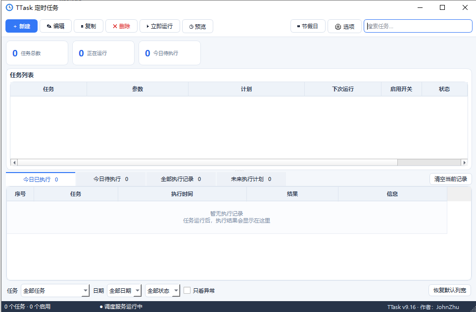
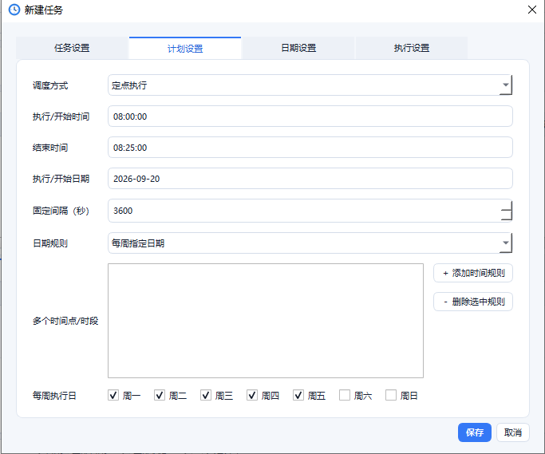
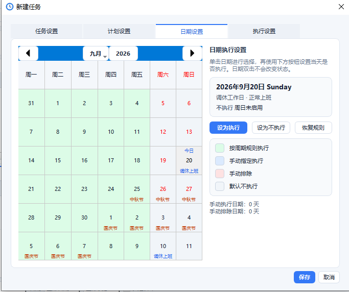
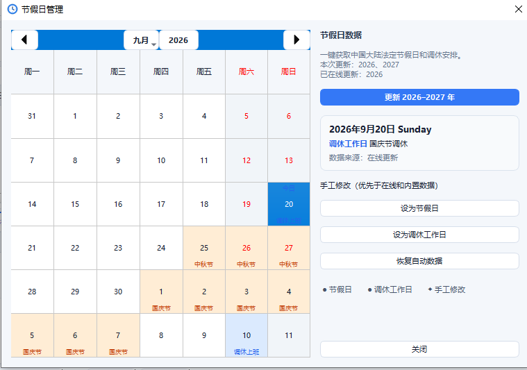

# TTask

Windows 现代化桌面定时任务工具，界面使用 PySide6/Qt 实现。

当前版本：**v9.16.1**　·　[下载最新版](https://github.com/JohnZhuY/TTask/releases/latest)　·　[查看更新记录](CHANGELOG.md)

- 周一至周五按所选星期自动运行
- 周六、周日默认不运行，可指定某个周末日期作为一次执行例外
- 固定时间执行
- 指定时间段内随机执行一次
- 执行命令/脚本或发送桌面通知
- 打开文件、HTTP 请求、复制或移动文件
- SQLite 持久化、重复执行保护和系统托盘运行
- 临时排除日期、失败重试和未来 10 次执行预览
- 一次性指定日期任务和固定秒数间隔任务
- 同一任务可配置多个定点时间或多个随机时间段
- `{date}`、`{time}`、`{datetime}`、`{weekday}`、`{task_name}` 变量模板
- 连续失败自动停用和异常退出恢复
- 任务复制、开机自启和托盘后台运行
- 第二次启动时自动唤醒已运行的主窗口
- 紧凑型经典 Windows 工具界面、图标工具栏、状态配色和任务搜索
- 可视化执行日期日历，可直接点击日期切换执行或排除
- 日期格使用勾选/取消勾选表示执行与不执行
- 任务编辑采用“任务设置、计划设置、日期设置、执行设置”四个分页
- “选项”打开独立设置窗口，可配置开机自启、关闭行为和桌面通知
- “选项 → 外观”可选择界面语言并将全局字体大小调整为 `9–16 pt`
- 任务列表的启用开关可直接点击；工具栏只保留常用操作

## 软件截图

### 主界面



### 任务计划设置



### 日期规则设置



### 节假日管理



## 安装与启动

```powershell
.\venv\Scripts\python.exe -m pip install -r requirements.txt
.\venv\Scripts\python.exe -m ttask
```

数据默认保存在 `%USERPROFILE%\.ttask\ttask.db`。

界面和系统托盘均由 PySide6 提供。

## 外观与语言

在主界面点击“选项”，进入“外观”分页后可以配置：

- 界面语言：跟随系统、简体中文或 English。
- 字体预设：小、标准、大，也可以在 `9–16 pt` 范围内自定义，默认 `10 pt`。
- 界面缩放：`90%`、`100%`、`110%` 或 `125%`。
- 主题：跟随系统、浅色或深色。
- 表格密度：紧凑、标准或宽松，并可关闭隔行背景色。
- 一键清除已保存的窗口、分栏、分页和表格列布局。

外观设置保存在本地数据库的 `app_settings` 表中，下次启动时会自动恢复。字体大小立即生效；切换界面语言后需要重新启动 TTask，以便所有已创建窗口统一加载对应语言资源。

## 设置中心

“选项”窗口提供以下设置页：

- **常规**：开机自启、开机进入托盘、关闭行为、窗口布局恢复、上次任务选择、桌面通知和立即运行确认。
- **调度**：新任务默认日期规则、默认错过计划策略、未来计划数量、失败停用次数、休眠恢复检查和任务并发策略。随机时段使用任务随机种子、日期和时间段生成，同一天重启后时间保持不变。
- **数据与日志**：查看并打开数据目录、在线 SQLite 备份、经完整性验证的恢复、日志保留与自动清理、诊断信息导出和数据库健康检查。
- **节假日**：自动更新、更新年份范围、数据来源与更新时间、离线提示、恢复内置数据以及节假日 JSON 导入导出。
- **关于**：版本、作者、GitHub、更新检查、更新日志、MIT 许可证、问题反馈和支持项目。

恢复数据库会覆盖当前任务、设置及执行记录，操作前会要求确认。建议先使用“备份数据库”生成一个可恢复副本。诊断信息不包含任务动作参数和执行消息等敏感内容。

## 调度语义

例如任务设置为周一至周五 `08:00:00–08:25:00`：

- 每个工作日在该时间段内产生一个稳定的随机时间。
- 同一个任务、同一个日期的随机结果不会因软件重启而变化。
- 周末不自动执行。
- 将某个周六或周日加入“周末指定日期”后，该日按照原定点或随机规则执行一次。
- “立即运行”不会占用计划执行次数。

## 动作输入格式

- 命令：`python "D:\scripts\job.py"`
- 打开程序/文件：直接填写目标路径
- HTTP：`GET|https://example.com` 或 `POST|URL|请求体`
- 复制/移动：`源路径|目标路径`

任务编辑窗口可以设置失败重试次数和间隔。任务列表选择一项后，可以查看未来 10 次执行时间。

执行日志支持状态筛选、完整详情、CSV 导出和清空。一次性任务执行后不会再次调度；固定间隔任务可设置开始日期、开始时间和间隔秒数，并继续遵循工作日、周末例外及排除日期规则。

计划设置中的“多个时间点/时段”支持：

- 定点任务：添加 `08:00:00`、`12:30:00`、`17:45:00` 等多个时间点。
- 随机任务：添加 `08:00:00–08:25:00`、`13:00:00–13:30:00` 等多个随机时间段。

任务编辑窗口中的“打开执行日期日历”使用以下颜色：

- 绿色：按照星期规则执行
- 灰色：不执行
- 蓝色：手动添加的执行日期
- 红色：手动排除的日期

点击任意日期即可切换状态；一次性任务点击日期会直接修改执行日期。

## 测试

```powershell
.\venv\Scripts\python.exe -m unittest discover -s tests -v
```

## 打包

安装依赖后执行：

```powershell
.\build.ps1
```

生成程序位于 `dist\TTask\TTask.exe`。

## 安全提示

TTask 可以使用当前 Windows 用户权限执行命令、访问网络以及复制或移动文件。请仅创建和运行可信任务，并在启用前检查命令参数、路径和 URL。安全问题请参阅 [SECURITY.md](SECURITY.md)。

## 参与贡献

提交代码前请运行完整测试。开发环境和 Pull Request 说明参阅 [CONTRIBUTING.md](CONTRIBUTING.md)，版本变化参阅 [CHANGELOG.md](CHANGELOG.md)。

## 支持项目

如果 TTask 对你有所帮助，可以通过微信或支付宝支持项目的持续开发。感谢你的支持！

<table>
  <tr>
    <th>微信支付</th>
    <th>支付宝</th>
  </tr>
  <tr>
    <td></td>
    <td></td>
  </tr>
</table>

## 开源许可证

TTask 使用 [MIT License](LICENSE) 开源。PySide6、Qt 和其他依赖仍分别遵循其自身许可证，详情参阅 [THIRD_PARTY_NOTICES.md](THIRD_PARTY_NOTICES.md)。
